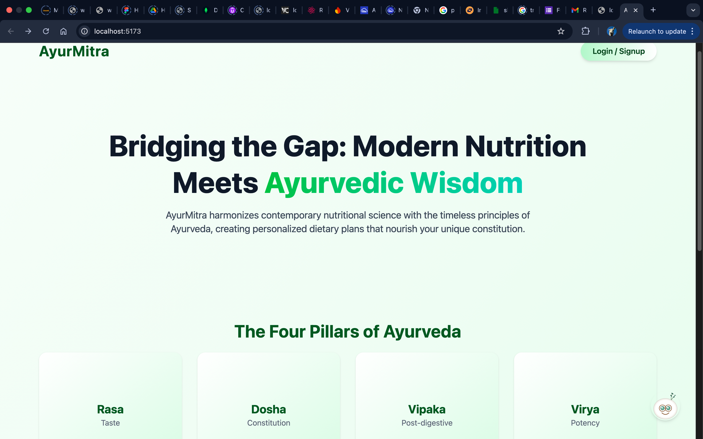
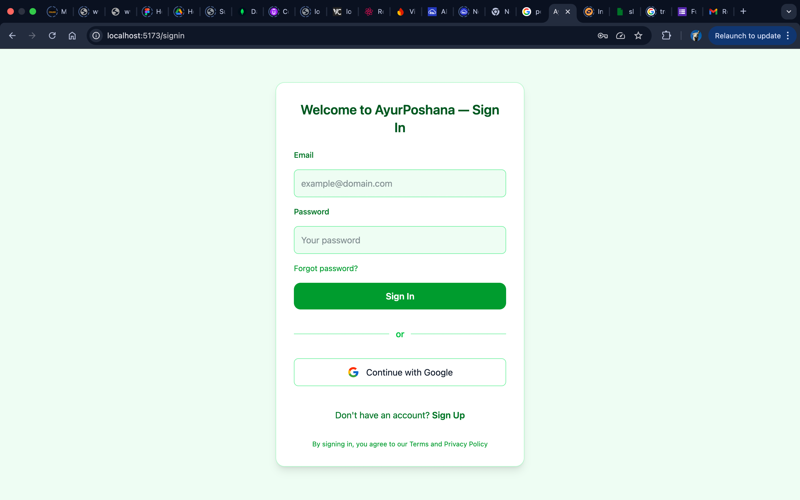
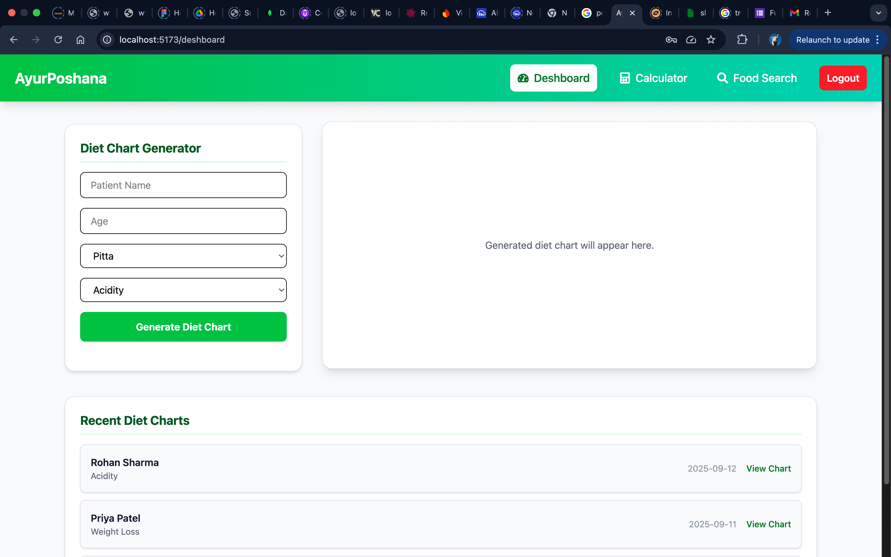

# 🌿 Ayur-Poshana  
_A holistic Ayurveda-based nutrition and wellness platform_

## 📌 Overview  
Ayur-Poshana is a full-stack application designed to blend **Ayurvedic diet principles** with modern nutrition tracking.  
Users can monitor meals, receive personalized Ayurvedic recommendations, and maintain long-term wellness progress.

This project contains two major modules:  
- **Backend (Node.js/Express)**  
- **Frontend (React)**  

---

## ✨ Features  
- 🔐 **User Authentication** (Register/Login)  
- 🍽 **Meal Logging** with time, quantity & details  
- 🌱 **Ayurvedic Diet Suggestions** based on user profile  
- 📊 **Nutrition Tracking Dashboard**  
- 📱 **Responsive UI** for mobile and desktop  
- ⚡ **REST API Backend** supporting CRUD operations  

---

## 🛠 Tech Stack  
**Frontend**  
- React  
- React Router  
- CSS / SCSS  
- Axios  

**Backend**  
- Node.js  
- Express.js  
- MongoDB / Mongoose (Update if different)  
- JWT Authentication  

---

## 📸 Screenshots  

> Replace the paths below with your actual screenshot filenames.

  
  

---

## 🚀 Getting Started  

### ✅ Prerequisites  
- Node.js (v14+)  
- npm or yarn  
- MongoDB installed locally or cloud DB (like Atlas)

---

